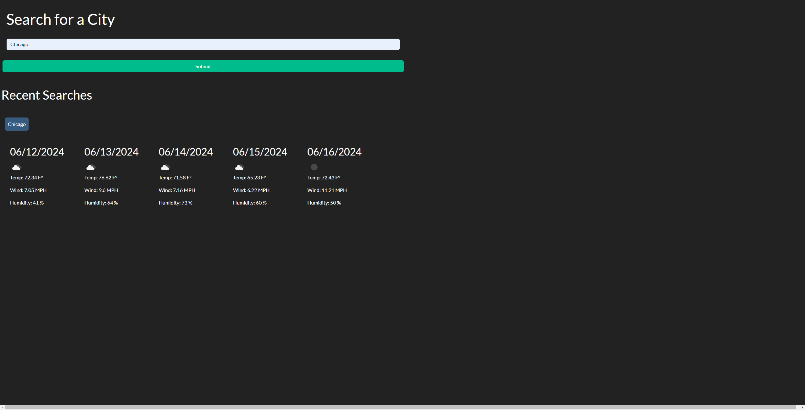

# Weather Dashboard

## Description

This challange required me to make a weather dashboard allowing the user to search for a cities 5 day forecast.  When  the user clicks submit, the date, an icon for the weather, temperature, wind speed, and humidity are displayed on the page.  The searched city name is also displayed in a button in the recent searches ssection.  When the user clicks the button the cities forecast is displayed once again.

## This was done by

-Taking user inputs from a form and adding them to a fetch request
-Using the api to select which list items we need to display
-Then finnaly appending data to html elemnts using javaScript

## Screenshot

## Links
[Live Url](https://bryson987081.github.io/weather-dashboard/)

[GitHub Repo](https://github.com/Bryson987081/weather-dashboard)